# Sprint Change Proposal: SubAgent View Feature

**Date:** 2026-01-21
**Author:** BMad Correct Course Workflow
**Status:** Pending Approval
**Change Scope:** Minor (Specification updates only)

---

## 1. Issue Summary

### Problem Statement

The current Grimoire specifications support sub-agent visibility through inline expansion only. When a user clicks a sub-agent bubble, it expands in place to show the agent's conversation. While this works for quick inspection, it has limitations:

1. **Context loss in deep nesting** - Expanding a sub-agent pushes parent conversation out of view
2. **No side-by-side comparison** - Cannot view parent and child conversations simultaneously
3. **Limited for running agents** - Live sub-agent streaming is harder to follow inline
4. **Inconsistent with session interaction model** - Main sessions open in tabs, sub-agents don't

### Proposed Solution

Add the ability to open sub-agent conversations in dedicated tabs, with visual differentiation (color tint + descriptive labels). This works alongside existing inline expansion, giving users both quick-peek and deep-dive options.

### Discovery Context

- **Source:** Brainstorming session on 2026-01-21
- **Techniques used:** First Principles Thinking, Morphological Analysis
- **Key insight:** Conversation loader should be unified - same code path for main and sub-agent conversations, differentiated only by file path

---

## 2. Impact Analysis

### Epic Impact

**N/A** - Project is in specification phase. No epics or stories exist yet.

### Artifact Impact Summary

| Artifact | Impact Level | Changes Required |
|----------|--------------|------------------|
| PRD | Medium | 4 FR additions, 2 FR modifications |
| Architecture | Medium | 3 new sections, 2 section updates |
| UX Specification | Medium | 3 component updates, 1 journey update |

### Technical Impact

- **No code changes** - Specification phase only
- **Architecture alignment** - Unified loader approach simplifies future implementation
- **Data model addition** - Sub-agent index structure (in-memory, not persisted)

---

## 3. Recommended Approach

**Selected Path:** Direct Adjustment

### Rationale

1. **Additive changes only** - All modifications extend existing specifications without replacing core concepts
2. **Architecture alignment** - Unified conversation loader matches existing patterns (single responsibility)
3. **UX enhancement** - Improves existing sub-agent visibility feature, doesn't change user mental model
4. **Low risk** - No implementation exists to break; specification changes are easily reversible

### Effort Assessment

| Area | Effort | Notes |
|------|--------|-------|
| PRD updates | Low | Adding FRs, minor modifications |
| Architecture updates | Medium | New sections for sub-agent handling |
| UX updates | Medium | Component and journey updates |
| **Total** | **Medium** | ~2-3 hours of specification work |

### Risk Assessment

| Risk | Likelihood | Impact | Mitigation |
|------|------------|--------|------------|
| Tab proliferation (too many open) | Low | Medium | User-controlled; close tabs anytime |
| Visual differentiation insufficient | Low | Low | Multiple signals: color + label format |
| Complexity creep | Low | Medium | Unified loader reduces, not increases, complexity |

---

## 4. Detailed Change Proposals

### 4.1 PRD Changes

#### Change PRD-1: Add Sub-Agent Tab Requirements

**Section:** Functional Requirements - Conversation Display (after FR37)

**ADD:**

```markdown
- FR37a: User can open sub-agent conversation in a dedicated tab by clicking "open in tab" button on sub-agent bubble
- FR37b: User can open sub-agent conversation in a dedicated tab by clicking sub-agent event in timeline
- FR37c: System displays sub-agent tabs with visual differentiation (color tint via CSS class)
- FR37d: System displays sub-agent tab label in format "{agentType}-{shortId}" (e.g., "Explore-a8b2")
```

**Rationale:** Extends existing FR36-37 (sub-agent expansion) with tab-opening capability. Provides two entry points (bubble and timeline) consistent with existing navigation patterns.

---

#### Change PRD-2: Extend Tab System Requirements

**Section:** Functional Requirements - Application Shell (FR5)

**OLD:**
```markdown
- FR5: User can open multiple sessions in a tab system (one session = one tab maximum)
```

**NEW:**
```markdown
- FR5: User can open multiple sessions in a tab system (one session = one tab maximum, sub-agent conversations open as additional tabs)
```

**Rationale:** Clarifies that sub-agent tabs are distinct from session tabs, allowing multiple tabs related to a single session.

---

#### Change PRD-3: Add Sub-Agent Index Requirement

**Section:** Functional Requirements - Session Management (after FR32)

**ADD:**

```markdown
- FR32a: System builds sub-agent index when session loads, containing path, parent reference, and label for each sub-agent
- FR32b: System updates sub-agent index when new sub-agents are discovered during streaming
```

**Rationale:** Enables fast sub-agent lookup without repeated file system scans.

---

#### Change PRD-4: Add Unified Loader Requirement

**Section:** Functional Requirements - CC Integration (after FR67)

**ADD:**

```markdown
- FR67a: System uses unified conversation loader for both main sessions and sub-agent conversations
- FR67b: System determines conversation type (main vs sub-agent) from file path, not loader logic
```

**Rationale:** Architectural simplification - same rendering code for all conversation types.

---

### 4.2 Architecture Changes

#### Change ARCH-1: Add Tab Type Enumeration

**Section:** Implementation Patterns & Consistency Rules - Naming Patterns (new subsection)

**ADD:**

```markdown
#### Tab Type Conventions

| Type | Value | Visual Treatment | Label Format |
|------|-------|------------------|--------------|
| Session | `'session'` | Default tab styling | Session name or "New Session" |
| SubAgent | `'subagent'` | `.tab--subagent` CSS class (color tint) | `{agentType}-{shortId}` |

**Tab interface extension:**
```typescript
interface Tab {
  id: string
  type: 'session' | 'subagent'
  sessionId: string           // Parent session ID
  agentId?: string            // Only for subagent type
  label: string
  conversationPath: string    // Path to JSONL file
}
```
```

**Rationale:** Type-safe differentiation between tab types with clear visual and data conventions.

---

#### Change ARCH-2: Add Sub-Agent Index Structure

**Section:** Spawn Child Architecture (new subsection after "Session ID Management")

**ADD:**

```markdown
### Sub-Agent Index

**Purpose:** Fast lookup of sub-agent metadata without repeated file system scans.

**Structure:**
```typescript
interface SubAgentEntry {
  agentId: string
  path: string                    // Path to sub-agent JSONL file
  parentId: string                // sessionId OR agentId (for nested)
  parentMessageUuid: string       // UUID of tool_use message that spawned this agent
  agentType: string               // "Explore", "Bash", etc.
  label: string                   // "{agentType}-{shortId}"
}

// Stored in main process memory
const subAgentIndex = new Map<string, SubAgentEntry>()
```

**Lifecycle:**
| Event | Action |
|-------|--------|
| Session loads | Scan session folder for sub-agent files, populate index |
| Tab opens (any conversation) | Scan that conversation's folder, add to index |
| New sub-agent spawned | Add entry from stream event |
| App quit | Index discarded (rebuilt on next session load) |

**Discovery Pattern:**
- Sub-agent files located at: `{sessionFolder}/subagents/agent-{agentId}.jsonl`
- Nested sub-agents follow same pattern within their parent's folder
```

**Rationale:** Enables O(1) sub-agent lookup. Index is ephemeral (memory only) since source of truth is file system.

---

#### Change ARCH-3: Add Unified Conversation Loader

**Section:** Spawn Child Architecture (new subsection)

**ADD:**

```markdown
### Unified Conversation Loader

**Principle:** Single loader function handles both main session and sub-agent conversations.

```typescript
// plugins/sessions/src/main/conversation-loader.ts
async function loadConversation(path: string): Promise<Conversation> {
  // Same logic regardless of main vs sub-agent
  // Path is the only differentiator
  const lines = await readJsonlFile(path)
  return parseConversation(lines)
}
```

**Caller determines path:**
- Main session: `{CLAUDE_CONFIG_DIR}/projects/{hash}/{sessionId}.jsonl`
- Sub-agent: From `subAgentIndex.get(agentId).path`

**No conditionals based on conversation type** - rendering logic is identical.
```

**Rationale:** Architectural simplification per brainstorming session findings.

---

#### Change ARCH-4: Update IPC Channels

**Section:** Implementation Patterns - IPC Channel Naming Conventions

**ADD to channel list:**

```markdown
// Request channels (renderer → main)
'subagent:openTab'        // Open sub-agent in new tab
'subagent:getIndex'       // Get current sub-agent index

// Event channels (main → renderer)
'subagent:discovered'     // New sub-agent found during scan/stream
```

**Rationale:** Consistent with existing `namespace:action` pattern.

---

#### Change ARCH-5: Update Project Structure

**Section:** Project Structure & Boundaries - Complete Project Directory Structure

**ADD under `plugins/sessions/src/main/`:**

```markdown
│           │   ├── conversation-loader.ts
│           │   ├── conversation-loader.test.ts
│           │   ├── subagent-index.ts
│           │   ├── subagent-index.test.ts
```

**ADD under `plugins/sessions/src/renderer/`:**

```markdown
│           │   ├── SubAgentTab.tsx
│           │   ├── SubAgentTab.test.tsx
```

**Rationale:** Explicit file locations for new functionality.

---

### 4.3 UX Specification Changes

#### Change UX-1: Update Sub-Agent Bubble Component

**Section:** Component Strategy - Custom Components - Sub-Agent Bubble

**OLD:**
```markdown
**Sub-Agent Bubble:**
```
┌─────────────────────────────────┐
│ [A] Code Analysis Agent    Done │
└─────────────────────────────────┘
14:32
```
- Alignment: Left
- Background: Agent background (purple-tinted)
- Border: Agent border (purple)
- Expandable: Click to see full conversation
```

**NEW:**
```markdown
**Sub-Agent Bubble:**
```
┌─────────────────────────────────────────┐
│ [A] Code Analysis Agent    Done    [↗] │
└─────────────────────────────────────────┘
14:32
```
- Alignment: Left
- Background: Agent background (purple-tinted)
- Border: Agent border (purple)
- **Primary action (click):** Expand inline to see conversation summary
- **Secondary action ([↗] button, visible on hover):** Open full conversation in dedicated tab

**Interaction States:**
| State | Display |
|-------|---------|
| Collapsed | Agent name + status + [↗] on hover |
| Expanded (inline) | Summary conversation + [↗] always visible |
| Running | Animated `···` indicator + [↗] to open live view in tab |
```

**Rationale:** Preserves inline expansion as primary (quick-peek), adds explicit tab-opening affordance.

---

#### Change UX-2: Add Sub-Agent Tab Styling

**Section:** Component Strategy - Custom Components - Tab Bar

**ADD after existing Tab States:**

```markdown
**Sub-Agent Tab Variant:**
```
┌────────────────────────────────────────────────────────┐
│ [Session ×] [Explore-a8b2 ×] [+]              [🚪] [🚪] │
└────────────────────────────────────────────────────────┘
              ↑ purple tint background
```

**Sub-Agent Tab States:**
- Default: Muted text, subtle purple tint background
- Hover: Primary text, close button visible
- Active: Primary text, accent underline, purple tint

**Tab Label Format:** `{agentType}-{shortId}` (e.g., "Explore-a8b2", "Bash-f3c1")

**CSS Class:** `.tab--subagent` applied when `tab.type === 'subagent'`
```

**Rationale:** Visual differentiation without new component. Color tint + label format provides clear hierarchy.

---

#### Change UX-3: Update Event Timeline Item

**Section:** Component Strategy - Custom Components - Event Timeline Item

**ADD to Properties:**

```markdown
**Sub-Agent Events:**
- Display: Agent type + short ID (e.g., "Explore-a8b2")
- Click behavior: Opens sub-agent in dedicated tab (not inline scroll)
- Visual: Purple-tinted background (matches sub-agent bubble)
```

**Rationale:** Timeline provides second entry point to sub-agent tabs, consistent with existing "click event to navigate" pattern.

---

#### Change UX-4: Update Journey 4 (Sub-Agent Drill-Down)

**Section:** User Journey Flows - Journey 4: Sub-Agent Drill-Down

**ADD alternative path to flow:**

```markdown
**Flow (Extended):**

```mermaid
flowchart TD
    A[See Sub-Agent Bubble] --> B{Collapsed State}
    B --> C[Shows: Agent Name + Status + ↗ on hover]
    C --> D{User Action}
    D -->|Click bubble| E[Inline Expansion]
    D -->|Click ↗ button| F[Open in New Tab]
    D -->|Click in Timeline| F
    E --> G[View Agent Summary]
    G --> H{Need More Detail?}
    H -->|Yes| I[Click ↗ in expanded view]
    I --> F
    H -->|No| J[Click to Collapse]
    J --> B
    F --> K[Sub-Agent Tab Opens]
    K --> L[Full Conversation View]
    L --> M[Same UI as Main Session]
    M --> N[Can Type to Continue Sub-Agent]
```



**New Interaction Pattern:**
| Entry Point | Action | Result |
|-------------|--------|--------|
| Collapsed bubble click | Single click | Inline expansion (existing) |
| [↗] button on bubble | Click | Opens sub-agent in new tab |
| Event timeline click | Click sub-agent event | Opens sub-agent in new tab |
| Expanded bubble [↗] | Click | Opens sub-agent in new tab |
```

**Rationale:** Documents both paths (inline and tab) with clear user decision points.

---

## 5. Implementation Handoff

### Change Scope Classification

**Minor** - All changes are specification updates. No existing implementation affected.

### Handoff Recipients

| Role | Responsibility |
|------|----------------|
| Solo Developer (You) | Update specification documents per this proposal |
| Future Implementation | Follow updated specifications when building Sessions plugin |

### Action Items

1. [ ] Apply PRD changes (PRD-1 through PRD-4)
2. [ ] Apply Architecture changes (ARCH-1 through ARCH-5)
3. [ ] Apply UX Specification changes (UX-1 through UX-4)
4. [ ] Review updated documents for consistency

### Success Criteria

- [ ] All FRs numbered correctly and don't conflict
- [ ] Architecture patterns consistent with existing conventions
- [ ] UX components maintain existing interaction principles
- [ ] No orphaned references between documents

---

## Appendix: Approaches Considered

### Tab Visual Differentiation

| Approach | Considered | Selected | Rationale |
|----------|------------|----------|-----------|
| Color tint only | Yes | Partial | Subtle but may be missed |
| Different icon | Yes | No | Icon clutter |
| Badge on tab | Yes | No | Visual noise |
| Label format | Yes | Partial | Clear hierarchy |
| **Color tint + Label format** | Yes | **Yes** | Best balance of visibility and cleanliness |

### Sub-Agent Opening Trigger

| Approach | Considered | Selected | Rationale |
|----------|------------|----------|-----------|
| Click replaces inline expand | Yes | No | Loses quick-peek capability |
| Dedicated [↗] button | Yes | **Yes** | Explicit, no conflict with expand |
| Double-click / right-click | Yes | No | Hidden affordance |
| Timeline click | Yes | **Yes** | Consistent with navigation patterns |

### Sub-Agent Discovery

| Approach | Considered | Selected | Rationale |
|----------|------------|----------|-----------|
| Scan on demand | Yes | No | Slower lookups |
| Index on session load | Yes | **Yes** | Best performance/resource balance |
| Background indexing all | Yes | No | Wasteful, slow startup |

---

*Generated by BMad Correct Course Workflow*
