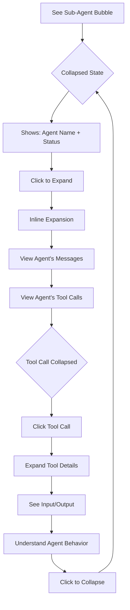

# UX Design Specification Grimoire

**Author:** Teazyou
**Date:** 2026-01-15

---

## Executive Summary

### Project Vision

Grimoire transforms Claude Code from a terminal-only CLI into a visual, interactive desktop client. It addresses the core observability problem: when CC spawns sub-agents and executes tools, the terminal output becomes opaque and unnavigable. Grimoire provides a clean, progressive-disclosure interface where complexity is available on demand but never overwhelming.

The success gate is clear: if Grimoire isn't faster than CLI for managing sessions, it fails.

### Target Users

**Primary User: Power User (Creator)**
- Solo developer running Claude Code across diverse domains
- Multiple sessions daily, from quick questions to complex multi-agent workflows
- Technical proficiency: intermediate-to-advanced CLI user
- Needs: trace sub-agent conversations, understand tool usage, navigate long sessions, compare multiple sessions

### Key Design Challenges

1. **Information hierarchy at scale** - Sessions with 100+ messages containing nested sub-agents and tool calls must feel clean while providing instant access to deep information through progressive disclosure.

2. **Multi-panel state coordination** - Three panels (session list, conversation, info/events) must maintain clear state relationships and intuitive behavior when switching contexts.

3. **Visual language for message types** - User input, CC messages, sub-agents, tool calls, and errors each need instant visual recognition without creating visual noise. Dark mode is primary.

4. **Tab-based multi-session** - Supporting simultaneous work across multiple open sessions with clear identity and easy switching.

### Design Opportunities

1. **Event Timeline navigation** - A condensed one-line-per-event view in the right panel transforms "scroll and hunt" into "scan and click." This is a key differentiator from terminal.

2. **Obsidian mental model** - The ribbon + panels + progressive disclosure pattern leverages existing familiarity, reducing learning curve.

3. **Dark-first design** - Building dark mode as primary enables better contrast decisions and visual hierarchy from the start.

## Core User Experience

### Defining Experience

Grimoire is the **primary interface for Claude Code work**, not a session viewer. Users do their actual CC work inside Grimoire - starting new sessions, continuing old ones, running complex workflows. Observability is a natural byproduct of working in the interface, not a separate review activity.

The core interaction: **Type a message, hit Enter, work happens with full visibility.**

### Platform Strategy

- **Platform:** Electron desktop application
- **Primary OS:** macOS (Phase 1), architecture supports future Windows/Linux
- **Input:** Mouse and keyboard primary
- **Theme:** Dark mode default, designed dark-first
- **Connectivity:** Offline for browsing history and UI, online required for CC execution

### Effortless Interactions

**Zero-Click to First Action Principle:** The app anticipates user intent and is ready immediately. When Grimoire launches, it opens to a new session with the cursor already in the input box. No clicks required to start working.

| Interaction | Clicks Required | Implementation |
|-------------|-----------------|----------------|
| Start new session on app launch | 0 | App opens → cursor in input → type → Enter |
| Start new session while using app | 1 | Click "+" → cursor in input → type → Enter |
| Continue any session | 1 | Click session → cursor in input → type → Enter |
| Navigate long session | 1 | Click event in timeline → instant scroll |
| Understand sub-agent | 1 | Click bubble → inline expansion |
| Compare sessions | 2 | Right-click → "Open in new tab" (or drag) |

**Micro-interaction Details:**
- Input box always auto-focused when session is selected
- Enter sends message (Shift+Enter for newline)
- Escape clears input or closes expanded elements
- Tab navigation follows logical flow (session list → conversation → input)

### Critical Success Moments

1. **App launch → first message** - Open Grimoire → cursor ready → type → Enter → CC spawns → response streams. Zero friction from launch to work.

2. **Session resume** - Click any historical session, type a follow-up, conversation continues seamlessly. No "loading" or "reconnecting" friction.

3. **Workflow completion** - When a complex multi-agent workflow finishes, user already understands what happened. No post-hoc investigation needed.

4. **Failure diagnosis** - When something goes wrong, the failing agent/tool is immediately visible. Error → understanding in seconds, not minutes.

### Experience Principles

1. **Zero-click to first action** - Minimize interactions to execute any action. The app should anticipate intent and be ready. Every extra click is a failure.

2. **Work-first, observe always** - Primary interface for doing CC work. Observability is built-in, not bolted-on.

3. **Session continuity is sacred** - Starting new and continuing old sessions must feel identical. Click, type, go.

4. **Terminal replacement, not supplement** - If the user opens terminal for any CC task, Grimoire has failed its mission.

5. **Understanding without effort** - Users never "go look at what happened." They already know because they worked with full visibility.

## Desired Emotional Response

### Primary Emotional Goals

**Core Emotion: Effortless Mastery**

Users should feel that everything is exactly where they expect it, they always understand what's happening, and they are completely in control. The interface should feel like an extension of their intent, not a barrier to overcome.

**Supporting Emotions:**
- **Relief** - "Finally I can see what Claude Code is actually doing"
- **Confidence** - "I understand exactly what each agent did and why"
- **Efficiency** - "This is genuinely faster than terminal"
- **Curiosity** - When something breaks, the instinct is to investigate, not retreat

### Emotional Journey Mapping

| Stage | Desired Emotion |
|-------|-----------------|
| App launch | Anticipation → Immediate readiness (cursor in input, ready to work) |
| Starting work | Confidence → "I know exactly what to do" |
| During workflow | Engaged clarity → Watching with full understanding |
| Workflow complete | Satisfaction → "I saw everything, I understand what happened" |
| Error occurs | Calm curiosity → "Let me drill into this" (not panic) |
| Returning later | Familiarity → "Everything is where I left it" |

### Micro-Emotions

**Emotions to Cultivate:**
- Confidence over confusion
- Trust over skepticism
- Accomplishment over frustration
- Calm over anxiety
- Curiosity over avoidance

**Emotions to Prevent:**
- Confused about UX/UI or where things are
- Confused about feature purpose or usage
- Frustrated by perceived slowness
- Lost in complexity or nested interfaces
- General frustration from unexpected behavior

### Design Implications

| Desired Emotion | Design Approach |
|-----------------|-----------------|
| Effortless | Self-evident UI. Buttons where expected. No hunting for controls. |
| In control | Always show system state. Active indicators. Clear feedback loops. |
| Confident | Progressive disclosure - depth available but never forced. |
| Relieved | Visibility that terminal cannot provide (sub-agents, tool details). |
| Calm on error | Errors highlighted clearly but not alarmingly. Actionable messaging. |
| Curious | Drill-down is inviting. "Click to explore" not "click to reveal wall of text." |

### Emotional Design Principles

1. **Self-evident over documented** - If a user needs to read instructions to use a feature, the design has failed. Every control should communicate its purpose visually.

2. **Calm over alarming** - Errors and issues are highlighted clearly but presented calmly. Red for errors, but not flashing or panic-inducing. Always show the path forward.

3. **Inviting depth** - Collapsed/expandable elements should invite exploration, not hide complexity. The user should feel "I can go deeper" not "what's hiding in there?"

4. **Predictable behavior** - Every interaction should behave as expected. No surprises, no "why did that happen?" moments. Consistency builds trust.

5. **Speed is emotional** - Perceived performance directly impacts emotional state. Instant feedback, smooth animations, no blocking operations. Slowness creates frustration; speed creates confidence.

## UX Pattern Analysis & Inspiration

### Inspiring Products Analysis

**Obsidian (Primary Inspiration - Phase 1)**

Obsidian provides the foundational UX mental model for Grimoire. Key qualities:
- Clean, focused interface that scales from simple notes to complex knowledge management
- Flexible panel system that adapts to different work styles
- Power-user friendly with extensive keyboard shortcuts
- Plugin architecture that keeps core lean while enabling extensibility
- Excellent dark mode as default

**N8N (Future Inspiration - Workflow Builder)**

N8N's node-based visual workflow system will inform future workflow builder features:
- Canvas-based workflow visualization
- Clear node-to-node connections showing data/control flow
- Click-to-configure node parameters

### Transferable UX Patterns

**From Obsidian:**

| Pattern | Grimoire Implementation |
|---------|------------------------|
| Ribbon navigation | Vertical icon bar (left edge) for switching between app sections |
| Flexible panel system | Left panel (sessions), Middle panel (conversation), Right panel (toggleable content) |
| Panel content switching | Right panel toggles: session info OR event timeline |
| Show/hide panels | Collapsible left and right panels for focused work |
| Progressive disclosure | Sub-agents and tool calls collapsed by default, expand on click |
| Keyboard shortcuts | Cmd+N (new session), Cmd+/ (toggle panels), arrow navigation |
| Plugin architecture | Core features (Sessions) built on same system future plugins will use |

**Future Patterns (N8N):**

| Pattern | Future Implementation |
|---------|----------------------|
| Node canvas | Visual workflow builder for agent chains |
| Connection visualization | Agent-to-agent data/control flow |
| Click-to-configure | Inline agent/tool parameter editing |

### Anti-Patterns to Avoid

| Anti-Pattern | Risk | Prevention |
|--------------|------|------------|
| Hidden navigation | Users can't find features | Ribbon always visible, self-evident icons |
| Mystery icons | Users guess button purposes | Tooltips on hover, clear iconography |
| Modal overload | Interrupts flow, loses context | Prefer inline expansion over modals |
| Nested menus | Cognitive load, slow access | Flat hierarchy, direct panel access |
| Slow transitions | Breaks flow, feels sluggish | Instant switches, minimal animation |
| Forced complexity | Overwhelms on first use | Progressive disclosure, clean defaults |
| Inconsistent behavior | Breaks trust, creates confusion | Same interaction patterns throughout |

### Design Inspiration Strategy

**Adopt Directly:**
- Ribbon + panel layout (proven, familiar to Obsidian users)
- Progressive disclosure pattern (collapse/expand)
- Keyboard shortcut philosophy (everything accessible via keyboard)
- Dark-first color scheme

**Adapt for Grimoire:**
- Panel content is conversation-focused, not document-focused
- Right panel serves dual purpose (info OR navigation) via toggle
- Event timeline is unique to Grimoire (no direct Obsidian equivalent)

**Avoid:**
- Obsidian's file-tree complexity (Grimoire has simpler session list)
- Graph view (not relevant for Phase 1)
- Tag/backlink systems (not applicable to sessions)

**Unique to Grimoire:**
- Event Timeline navigation (condensed one-line-per-event view)
- Sub-agent inline expansion in conversation
- Child process lifecycle visualization

## Design System Foundation

### Design System Requirements

The design system must support Grimoire's core UX needs:

| Requirement | Priority | Rationale |
|-------------|----------|-----------|
| Dark mode as primary | Critical | Core design decision - all color choices, contrast, hierarchy built dark-first |
| Panel-based layout | Critical | Obsidian-inspired ribbon + collapsible left/middle/right panels |
| Keyboard accessibility | Critical | Power users expect full keyboard navigation |
| Progressive disclosure | Critical | Collapse/expand for sub-agents, tool calls, session info |
| Conversation UI | Critical | Custom components: message bubbles, tool cards, sub-agent containers |
| Minimal aesthetic | High | Clean, not overwhelming - professional developer tool feel |
| Fast rendering | High | Must handle 100+ message sessions with real-time streaming |
| Theming support | Medium | CSS variables or equivalent for future light mode, user themes |

### Evaluation Criteria

During Architecture planning, evaluate design system options against:

1. **Dark-first support** - Native dark mode, not CSS overrides
2. **Component flexibility** - Ability to build custom conversation UI components
3. **Keyboard/accessibility** - Accessible primitives, focus management
4. **Performance** - Virtualization-compatible for long scrolling lists
5. **Theming architecture** - CSS variables or design tokens for easy customization
6. **Bundle efficiency** - Tree-shakeable, import only what's needed
7. **Documentation quality** - Essential for solo developer productivity

### Recommended Approach

**Utility-first CSS + Headless Components**

The UX requirements point toward a system that provides:
- Utility classes for rapid styling (Tailwind-style)
- Headless/unstyled accessible primitives (Radix-style)
- Full ownership of component code (not locked into library aesthetics)

This approach enables:
- Custom Obsidian-inspired visual language
- Dark-first color system without fighting framework defaults
- Conversation UI components built to exact specifications
- Future theming without major refactoring

**Specific implementation choice deferred to Architecture workflow.**

### Custom Components Needed

Components not typically found in design systems that Grimoire requires:

| Component | Purpose |
|-----------|---------|
| Message Bubble | User/Claude conversation display |
| Tool Call Card | Collapsible tool usage display |
| Sub-Agent Container | Nested conversation with expand/collapse |
| Event Timeline Item | One-line event for navigation panel |
| Session List Item | Session preview with status indicators |
| Panel Toggle | Show/hide panel controls |
| Tab Bar | Multi-session tab management |
| Status Indicator | Active/paused/error session states |

## Defining Experience

### The Core Interaction

**"CLI power, visual clarity - no compromise on either."**

Grimoire's defining experience is bringing the full power of Claude Code's CLI into a visual interface that anyone can understand. The "wow" moment isn't revealing complexity - it's achieving simplicity. Users start a powerful multi-agent workflow and think "this is so easy to understand."

**How users describe it:** "It's the power of CLI AI tools inside a UI for everyone."

### User Mental Model

Users come from terminal-based Claude Code with this mental model:

| Terminal Experience | Grimoire Experience |
|--------------------|---------------------|
| Powerful but opaque | Powerful AND clear |
| Expert-only access | Accessible to everyone |
| Text wall, hunt for info | Structured, scannable, organized |
| "What just happened?" | "I saw exactly what happened" |
| Lost context in long sessions | Event timeline for instant navigation |
| Sub-agents invisible | Sub-agents visible and explorable |

**Key Mental Model Shift:** From "power requires complexity" to "power with clarity."

### Success Criteria

| Criterion | Success Indicator |
|-----------|-------------------|
| Simplicity | First-time user starts and completes a workflow without confusion or documentation |
| Visibility | Every sub-agent, tool call, and decision is accessible within one click |
| Power | 100% of CLI capabilities available, 0% of CLI friction experienced |
| Speed | Faster to start/continue a session than opening terminal and typing `claude` |
| Understanding | User can explain what happened in a workflow immediately after completion |

### Novel UX Patterns

**Established Patterns (Adopt):**
- Chat interface for conversation (familiar from ChatGPT, Slack)
- Panel layout (familiar from Obsidian, VS Code)
- Collapsible sections (familiar from any tree view)

**Novel Patterns (Innovate):**
- **Sub-agent inline expansion** - Nested conversations that expand in place without losing parent context
- **Event Timeline navigation** - One-line-per-event summary for instant navigation in long sessions
- **Unified session interaction** - Historical and live sessions use identical interaction model (click, type, go)

**Teaching Novel Patterns:**
- Self-evident visual affordances (expand arrows, click targets)
- Consistent behavior everywhere (click to expand, always)
- No documentation required - if it needs explaining, redesign it

### Experience Mechanics

**1. Initiation - Start a Workflow**

| Step | Action | System Response |
|------|--------|-----------------|
| 1 | Open Grimoire | New session ready, cursor in input |
| 2 | Type prompt | Text appears in input box |
| 3 | Press Enter | CC child spawns, "Starting..." indicator |
| 4 | — | Response streams in real-time |

**2. Interaction - Watch it Unfold**

| Element | Behavior |
|---------|----------|
| Claude messages | Appear as bubbles, stream in real-time |
| Sub-agent spawns | Appear as collapsible containers, collapsed by default |
| Tool calls | Appear as compact cards with summary, expandable for details |
| Event timeline | Updates live, each event as one-line item |
| Status indicator | Shows active/thinking/waiting/error state |

**3. Feedback - Understand Everything**

| Feedback Type | Implementation |
|---------------|----------------|
| Visual hierarchy | Message types instantly distinguishable by shape/color |
| Progressive depth | Click anything to see more, never forced |
| System state | Always visible: what's running, what's waiting, what failed |
| Error clarity | Red indicator + actionable message, never just stack trace |

**4. Completion - Continue Anytime**

| Scenario | Experience |
|----------|------------|
| Workflow completes | User already understands what happened (watched it unfold) |
| Resume later | Click session → type → Enter → continues seamlessly |
| Review old session | Same UI, same interactions, same clarity |
| Compare sessions | Open in tabs, view side by side |

## Visual Design Foundation

### Color System

**Dark Theme (Primary)**

| Role | Value | Usage |
|------|-------|-------|
| Background (base) | `hsl(240, 10%, 10%)` | Main app background |
| Background (elevated) | `hsl(240, 10%, 13%)` | Panels, cards |
| Background (hover) | `hsl(240, 10%, 16%)` | Interactive hover states |
| Text (primary) | `hsl(0, 0%, 90%)` | Main content |
| Text (muted) | `hsl(0, 0%, 60%)` | Secondary info, timestamps |
| Border | `hsl(240, 10%, 20%)` | Subtle separation |

**Accent Color: Purple**

| Role | Value | Usage |
|------|-------|-------|
| Accent (primary) | `hsl(270, 60%, 55%)` | Interactive elements, focus |
| Accent (hover) | `hsl(270, 60%, 65%)` | Hover state |
| Accent (active) | `hsl(270, 60%, 45%)` | Active/pressed state |

Rationale: Purple differentiates Grimoire from blue-dominated developer tools (VS Code, etc.), aligns with Obsidian's aesthetic, and provides excellent contrast in dark UI without clashing with semantic colors.

**Semantic Colors**

| Role | Value | Usage |
|------|-------|-------|
| Success | `hsl(142, 50%, 45%)` | Completed, working |
| Warning | `hsl(38, 90%, 50%)` | Attention needed |
| Error | `hsl(0, 65%, 50%)` | Failures (calm, not alarming) |
| Info | `hsl(210, 60%, 50%)` | Informational states |

**Message Type Visual Language**

| Type | Visual Treatment |
|------|------------------|
| User input | Elevated background, right-aligned |
| Claude response | Base background, left-aligned |
| Sub-agent | Purple accent border (left), collapsed by default |
| Tool call | Muted background, monospace font, compact card |
| Error | Red left border, error background tint |

### Typography System

**Font Stack (Phase 1: System Fonts)**

```css
--font-family: system-ui, -apple-system, BlinkMacSystemFont, 'Segoe UI', Roboto, sans-serif;
--font-mono: 'SF Mono', SFMono-Regular, Consolas, 'Liberation Mono', Menlo, monospace;
```

Rationale: System fonts provide native feel, zero loading time, optimal rendering on each platform. Custom fonts (Inter) can be added in future phase if desired.

**Type Scale**

| Token | Size | Weight | Usage |
|-------|------|--------|-------|
| `--text-xs` | 11px | 400 | Timestamps, metadata |
| `--text-sm` | 13px | 400 | Secondary text, labels |
| `--text-base` | 14px | 400 | Body text, messages |
| `--text-md` | 16px | 500 | Emphasized text |
| `--text-lg` | 18px | 600 | Section headers |
| `--text-xl` | 24px | 600 | Page titles |

**Line Heights**

| Context | Line Height |
|---------|-------------|
| UI elements | 1.2 |
| Body text | 1.5 |
| Code/mono | 1.4 |

### Spacing & Layout Foundation

**Base Unit: 8px**

| Token | Value | Usage |
|-------|-------|-------|
| `--space-xs` | 4px | Tight gaps, icon padding |
| `--space-sm` | 8px | Default element spacing |
| `--space-md` | 16px | Section gaps, card padding |
| `--space-lg` | 24px | Panel padding, major sections |
| `--space-xl` | 32px | Page margins, large gaps |
| `--space-2xl` | 48px | Major layout divisions |

**Compact Mode**

Compact mode multiplier: `0.75x` - reduces all spacing proportionally for power users who prefer density.

**Panel Layout**

| Panel | Default Width | Collapsible |
|-------|---------------|-------------|
| Ribbon | 48px fixed | No |
| Left (Sessions) | 280px | Yes |
| Middle (Conversation) | Flex (remaining) | No |
| Right (Info/Events) | 300px | Yes |

**Border Radius**

| Token | Value | Usage |
|-------|-------|-------|
| `--radius-sm` | 4px | Buttons, inputs |
| `--radius-md` | 8px | Cards, panels |
| `--radius-lg` | 12px | Modals, dialogs |
| `--radius-full` | 9999px | Pills, avatars |

### Accessibility Considerations

**Contrast Requirements**

| Element | Minimum Ratio | Target |
|---------|---------------|--------|
| Body text on background | 4.5:1 | 7:1+ |
| Large text (18px+) | 3:1 | 4.5:1+ |
| Interactive elements | 3:1 | 4.5:1+ |
| Focus indicators | 3:1 | Visible |

**Keyboard Accessibility**

- All interactive elements focusable via Tab
- Visible focus ring using accent color
- Logical focus order following visual layout
- Escape key closes expanded elements/modals

**Motion Preferences**

- Respect `prefers-reduced-motion` system setting
- Minimal animations by default (instant feels faster)
- No animation required for functionality

## Design Direction Decision

### Design Directions Explored

Six design directions were evaluated, all respecting mandatory elements:
- Ribbon + two side panels + middle area layout
- Tab system for session management
- Panel top bars with plugin-specific controls
- Split conversation bubbles (intro → actions → conclusion)
- Chat-style event timeline with token counts

Directions explored:
1. **Classic Clean** - Comfortable spacing, clean separation, professional
2. **Compact Dense** - Maximum density, border accents, power-user focused
3. **Rounded Modern** - Soft aesthetics, pill-shaped bubbles, chat-app style
4. **Outlined** - Transparent backgrounds, border emphasis, elegant
5. **Terminal Hybrid** - Monospace typography, CLI heritage
6. **Soft Glow** - Subtle glow effects, premium depth

### Chosen Direction

**Classic Clean** with selective elements from Rounded Modern:

| Element | Source | Implementation |
|---------|--------|----------------|
| Overall layout | Classic Clean | Ribbon + 3 panels, comfortable spacing |
| Conversation bubbles | Classic Clean | Split bubbles per action, timestamps |
| Event timeline | Classic Clean (modified) | Chat-style bubbles WITHOUT icons, token counts |
| Session list items | Rounded Modern | Rounded corners, subtle border on active state |
| Visual hierarchy | Classic Clean | Clear separation, professional aesthetic |

### Design Rationale

- **Classic Clean base**: Faithful to Obsidian mental model, readable, professional
- **No event icons**: Cleaner timeline, density without clutter, text is sufficient
- **Rounded session styling**: Softer session cards create visual distinction from conversation area, improved hover/active states

### Implementation Approach

The chosen direction provides:
1. **Obsidian familiarity** - Users of Obsidian will feel immediately at home
2. **Clear message separation** - Each action (tool, agent, response) gets its own bubble
3. **Scannable timeline** - Chat-style events with token counts enable quick navigation
4. **Visual polish** - Rounded sessions add modern touch without departing from professional aesthetic

## User Journey Flows

### Journey 1: App Launch → First Message

The zero-friction entry point. User opens Grimoire and starts working immediately.

**Entry:** User launches Grimoire application

**Flow:**


**Key Interactions:**

| Step | User Action | System Response |
|------|-------------|-----------------|
| Launch | Double-click app | Loading screen appears |
| Ready | None (automatic) | New session view, cursor in input |
| Send | Type + Enter | UUID generated, CC spawns |
| Wait | Watch response | Real-time streaming |
| Pause | CC asks question | Child stops, session shows "paused" |

**Success Criteria:**
- Launch → typing: < 3 seconds
- No clicks required to start first message
- Errors are actionable (Retry button)

---

### Journey 2: Session Resume

Continuing any historical session seamlessly.

**Entry:** User clicks a session in the left panel

**Flow:**


**Key Interactions:**

| Step | User Action | System Response |
|------|-------------|-----------------|
| Select | Click session | Load conversation, scroll to end |
| Focus | Click input box | Cursor ready |
| Send | Type + Enter | CC spawns with session ID |
| Continue | Watch response | Conversation continues seamlessly |

**Design Decision:**
- NO auto-focus on input for existing sessions
- Scroll to latest message automatically
- User consciously clicks to engage

---

### Journey 3: Session Review & Investigation

Understanding what happened in a complex multi-agent session.

**Entry:** User wants to understand a completed/paused session

**Flow:**


**Key Interactions:**

| Step | User Action | System Response |
|------|-------------|-----------------|
| Load | Click session | Full conversation displayed |
| Scan | Visual scan | Error indicators visible (red) |
| Navigate | Click event in timeline | Conversation scrolls to that point |
| Drill | Click sub-agent bubble | Expands inline with full conversation |
| Understand | Read expanded content | Root cause identified |

**Event Timeline Usage:**
- One-line summaries for quick scanning
- Token counts show conversation growth
- Click to jump directly to that point
- User messages on right, system on left

---

### Journey 4: Sub-Agent Drill-Down

Detailed investigation of a specific sub-agent's behavior.

**Entry:** User sees sub-agent bubble in conversation

**Flow:**



**Expansion Behavior:**

| State | Display | Action |
|-------|---------|--------|
| Collapsed | Agent name + status badge | Click to expand |
| Expanded | Full conversation inline | Click header to collapse |
| Tool (collapsed) | Tool name + summary | Click to expand |
| Tool (expanded) | Full input/output | Click to collapse |

**Design Principle:**
- Progressive disclosure: summary → detail
- Never lose context (inline expansion, no modal)
- Clear visual hierarchy (agent → tools → details)

---

### Journey 5: Plugin Configuration

Customizing Grimoire behavior through plugin settings.

**Entry:** User opens Settings

**Flow:**


**Settings Scope (Sessions Plugin):**

| Setting | Options | Default |
|---------|---------|---------|
| Sub-agent default view | Collapsed / Expanded | Collapsed |
| Tool call display | Summary / Full | Summary |
| Sessions list count | 20 / 50 / 100 | 50 |
| Show token counts | On / Off | On |
| Advanced info toggle | Visible / Hidden | Visible |

---

### Journey Patterns

**Navigation Patterns:**
- **Click-to-act**: All navigation via single click
- **Scroll-to-context**: Existing sessions scroll to latest
- **Panel toggle**: Door button reveals/hides panels
- **Tab switching**: Multiple open sessions via tabs

**Feedback Patterns:**
- **Inline expansion**: Sub-agents and tools expand in place
- **Status indicators**: 6-state machine (Idle, Spawning, Working, Pending, Terminating, Error) with triple redundancy (color bar + icon + animation)
- **Real-time streaming**: Responses appear as they generate
- **Token counts**: Cumulative in timeline, per-message optional

**Error Patterns:**
- **Inline errors**: Error bubble in conversation flow
- **Retry action**: Button to retry failed operations
- **Actionable messaging**: Clear explanation + action button
- **No modal interrupts**: Errors don't block UI flow

---

### Flow Optimization Principles

1. **Zero-click start**: New sessions require 0 clicks before typing
2. **One-click resume**: Any session resumable with single click + type
3. **Inline everything**: No modals for viewing content, all inline expansion
4. **Scroll not hunt**: Timeline + scroll-to-event eliminates scrolling search
5. **Errors guide action**: Every error shows what to do next
6. **State always visible**: Active/paused/error visible at a glance

## Component Strategy

### Design System Components

**Foundation Layer (from headless/utility system):**

| Component | Usage | Notes |
|-----------|-------|-------|
| Button | Actions, toggles | Styled with utility classes |
| Input/Textarea | Chat input, search | Custom styling for dark theme |
| Tooltip | Icon explanations | Accessible, keyboard-triggered |
| Dropdown Menu | Context menus (3-dot) | Session actions |
| Toggle | Plugin enable/disable | Settings page |
| Scroll Area | Conversation, lists | Custom scrollbar styling |

**Why Headless + Utility:**
- Full control over visual styling (dark-first, purple accent)
- Accessible primitives without fighting default styles
- Build exactly what we need, nothing extra

---

### Custom Components

#### 1. Ribbon

**Purpose:** Primary app-level navigation between sections
**Location:** Fixed left edge, always visible

| Property | Value |
|----------|-------|
| Width | 48px fixed |
| Background | `--bg-base` darker variant |
| Items | Icon buttons, 34×34px |

**States:**
- Default: Muted icon color
- Hover: Elevated background, primary text
- Active: Accent background, accent color

**Behavior:**
- Click switches app section
- Tooltip on hover shows section name
- Keyboard: Tab to focus, Enter to activate

---

#### 2. Panel (Left/Right)

**Purpose:** Collapsible content containers for sessions and events
**Variants:** Left panel (280px), Right panel (300px)

**Anatomy:**
```
┌─────────────────────────────────┐
│ [Icon] [Icon] ... [Spacer] [🚪] │  ← Topbar (40px)
├─────────────────────────────────┤
│                                 │
│         Panel Content           │
│                                 │
└─────────────────────────────────┘
```

**States:**
- Expanded: Full width, content visible
- Collapsed: Only door button visible (extends from middle panel topbar)

**Door Button Behavior:**
- Position: Right side of topbar
- Click: Toggle panel visibility
- When collapsed: Button remains accessible in extended middle topbar

---

#### 3. Session List Item

**Purpose:** Display session in left panel list
**Style:** Rounded Modern (from design direction)

**Anatomy:**
```
┌────────────────────────────────┐
│ [⚡] Session Name        [🔌][⋮]│
│     2 hours ago                │
└────────────────────────────────┘
```

**Elements:**
- Left: State indicator (⚡ for connected, ⚠️ for error, none for idle)
- Center: Session name + timestamp
- Right: 🔌 disconnect button (only visible if instance exists) + ⋮ menu

**States:**
- Default: Subtle background
- Hover: Elevated background, 3-dot menu appears, 🔌 button visible if connected
- Active: Accent border, accent-tinted background
- Working: ⚡ + `···` animation, green color bar
- Pending: ⚡ icon, amber color bar
- Error: ⚠️ icon, red color bar

**Interaction:**
- Click: Load session in middle panel
- Hover: Reveal 3-dot context menu and 🔌 button
- 🔌 click: Disconnect (kill instance) - shows warning if Working state
- 3-dot click: Open dropdown (archive, delete, etc.)

---

#### 4. Tab Bar

**Purpose:** Manage multiple open sessions
**Location:** Top of middle panel

**Anatomy:**
```
┌─────────────────────────────────────────────────┐
│ [Tab 1 ×] [Tab 2 ×] [+]              [🚪] [🚪] │
└─────────────────────────────────────────────────┘
```

**Tab States:**
- Default: Muted text
- Hover: Primary text, close button visible
- Active: Primary text, accent underline

**Behavior:**
- Click tab: Switch to that session
- Click ×: Close tab
- Click +: New session
- Door buttons: Toggle left/right panels

---

#### 5. Message Bubble

**Purpose:** Display conversation messages
**Variants:** User, Claude, Tool, Sub-Agent

**User Bubble:**
```
┌─────────────────────────────────┐
│ Message content here...         │
└─────────────────────────────────┘
                            14:32
```
- Alignment: Right
- Background: Accent muted + accent border
- Border radius: Rounded, bottom-right smaller

**Claude Bubble:**
```
┌─────────────────────────────────┐
│ Message content here...         │
└─────────────────────────────────┘
14:32
```
- Alignment: Left
- Background: Elevated + subtle border
- Border radius: Rounded, bottom-left smaller

**Tool Bubble:**
```
┌─────────────────────────────────┐
│ Read  src/api/routes/index.ts   │
└─────────────────────────────────┘
14:33
```
- Alignment: Left
- Background: Tool background (blue-tinted)
- Border: Tool border (blue)
- Font: Monospace
- Expandable: Click to see input/output

**Sub-Agent Bubble:**
```
┌─────────────────────────────────┐
│ [A] Code Analysis Agent    Done │
└─────────────────────────────────┘
14:32
```
- Alignment: Left
- Background: Agent background (purple-tinted)
- Border: Agent border (purple)
- Expandable: Click to see full conversation

---

#### 6. Event Timeline Item

**Purpose:** One-line event in right panel for navigation
**Style:** Chat-style bubbles, left/right aligned

**User Event:**
```
                    ┌──────────────────────┐
                    │ I need to refactor...│ 1.2k
                    └──────────────────────┘
                                      14:32
```

**System Event (Claude/Tool/Agent):**
```
┌──────────────────────┐
│ Read routes/index.ts │ 3.4k
└──────────────────────┘
14:33
```

**Properties:**
- No icons (per design decision)
- Token count displayed like timestamp
- Click: Scroll conversation to that event
- Color-coded by type (subtle background differences)

---

#### 7. Topbar Icon Button

**Purpose:** Actions in panel topbars
**Size:** 28×28px

**States:**
- Default: Muted color
- Hover: Elevated background
- Active: Accent background + color
- Disabled: 50% opacity, no interaction

**Usage:**
- Left panel: Sessions icon (active), Workflows icon (disabled), Advanced toggle
- Right panel: Info tab, Events tab
- Door buttons: Panel collapse/expand

---

#### 8. Status Indicator

**Purpose:** Show session/process state
**Variants:** Color bar + Icon + Animation (triple redundancy)

**6-State Machine:**

| State | Visual | Icon | Animation | Usage |
|-------|--------|------|-----------|-------|
| Idle | No decoration | - | - | No instance running |
| Spawning | Subtle pulse | - | Fade pulse | Instance starting |
| Working | Green bar | ⚡ | `···` dots | CC processing |
| Pending | Amber bar | ⚡ | - | Waiting for input |
| Terminating | Gray bar | - | Fade out | Instance stopping |
| Error | Red bar | ⚠️ | - | Failed operation |

**Icon meanings:**
- ⚡ = Connected (instance exists) - state indicator on left
- ⚠️ = Error state (click for details)
- 🔌 = Disconnect button (click to kill instance) - action button on right, only visible on hover when connected

---

#### 9. Chat Input Area

**Purpose:** Message composition and sending
**Location:** Bottom of middle panel

**Anatomy:**
```
┌─────────────────────────────────────────────────┐
│ ┌─────────────────────────────────────────┐ [→] │
│ │ Type your message...                    │     │
│ └─────────────────────────────────────────┘     │
└─────────────────────────────────────────────────┘
```

**Behavior:**
- Auto-focus on new session
- NO auto-focus on existing session
- Enter: Send message
- Shift+Enter: New line
- Auto-expand up to max height
- Placeholder changes based on session state

---

### Component Implementation Strategy

**Approach:**
1. Build all components using design system tokens (colors, spacing, typography)
2. Use headless primitives for accessible behavior (focus, keyboard nav)
3. Style with utility classes for consistency
4. Create React components with TypeScript for type safety

**Token Usage:**
```css
/* All components reference design tokens */
--bg-base, --bg-elevated, --bg-hover
--accent, --accent-muted, --accent-hover
--text-primary, --text-muted
--space-xs, --space-sm, --space-md, --space-lg
--radius-sm, --radius-md
```

**Accessibility Standards:**
- All interactive elements focusable
- Visible focus indicators (accent color ring)
- ARIA labels for icon-only buttons
- Keyboard navigation throughout
- Escape closes expanded elements

---

### Implementation Roadmap

**Phase 1 - Core Components (MVP):**

| Component | Priority | Needed For |
|-----------|----------|------------|
| Ribbon | P0 | App navigation |
| Panel + Door Toggle | P0 | Layout system |
| Tab Bar | P0 | Multi-session |
| Session List Item | P0 | Session selection |
| Message Bubble (all variants) | P0 | Conversation display |
| Chat Input Area | P0 | User interaction |
| Status Indicator | P0 | Process feedback |

**Phase 2 - Enhancement Components:**

| Component | Priority | Needed For |
|-----------|----------|------------|
| Event Timeline Item | P1 | Session navigation |
| Topbar Icon Buttons | P1 | Panel controls |
| Context Menu (3-dot) | P1 | Session actions |

**Phase 3 - Polish Components:**

| Component | Priority | Needed For |
|-----------|----------|------------|
| Streaming Indicator | P2 | Response feedback |
| Error Bubble + Retry | P2 | Error handling |
| Loading States | P2 | Process feedback |

## UX Consistency Patterns

### Interaction Patterns

**Click Behavior:**

| Element | Single Click | Double Click | Right Click |
|---------|--------------|--------------|-------------|
| Session item | Select & load | - | Context menu |
| Tab | Switch to session | - | Context menu |
| Message bubble | - | - | Copy text |
| Sub-agent (collapsed) | Expand inline | - | - |
| Sub-agent (expanded) | Collapse | - | - |
| Tool call (collapsed) | Expand details | - | - |
| Event timeline item | Scroll to event | - | - |
| Ribbon icon | Switch section | - | - |
| Door button | Toggle panel | - | - |

**Expand/Collapse Pattern:**
- Click header to toggle
- Chevron icon indicates state (collapsed, expanded)
- Animation: 150ms ease-out
- Preserve scroll position when collapsing
- Never auto-collapse when user is reading

**Keyboard Navigation:**

| Key | Action |
|-----|--------|
| Tab | Move to next focusable element |
| Shift+Tab | Move to previous focusable |
| Enter | Activate focused element |
| Space | Toggle (checkboxes, expand/collapse) |
| Escape | Close expanded element, clear input |
| Arrow Up/Down | Navigate list items |
| Cmd+N | New session |
| Cmd+W | Close current tab |
| Cmd+1-9 | Switch to tab by number |

---

### Feedback Patterns

**Status Indicators (6-State Machine):**

| State | Visual | Color | Location |
|-------|--------|-------|----------|
| Idle | No indicator | - | - |
| Spawning | Subtle pulse | Gray | Session list, tab |
| Working | ⚡ + `···` animation | Green | Session list, tab |
| Pending | ⚡ icon | Amber | Session list, tab |
| Terminating | Fade out | Gray | Session list, tab |
| Error | ⚠️ icon | Red | Session list, tab, bubble |

**Streaming Feedback:**
- Cursor blink animation in message bubble while receiving
- Smooth scroll as content arrives
- No blocking UI during stream

**Success Feedback:**
- Operation completes silently (no toast for normal operations)
- Visual state change is sufficient feedback
- Success messages only for significant actions (e.g., "Session archived")

**Completion Notification (Session):**
- Brief flash highlight on session completion
- Settles to red dot badge in session list
- Red dot clears when session is focused
- If already focused: red dot clears after 2 seconds
- Optional completion sound (off by default, configurable in settings)

**Error Feedback:**
- Inline in conversation flow (error bubble)
- Red left border + subtle red tint background
- Clear error message (human-readable, not stack trace)
- Retry button when applicable
- Never modal unless action is destructive

**Loading Feedback:**
- Skeleton states for content loading
- "connecting..." indicator when spawning (subtle, non-blocking)
- Progress indication for long operations
- Never block the entire UI

---

### Navigation Patterns

**Panel Toggle (Door Button):**
- Position: Right side of panel topbar
- Icon: Door/sidebar icon
- Click: Slide panel closed (200ms ease)
- Collapsed state: Button remains in middle panel topbar
- Click again: Slide panel open

**Panel Toggle Behavior:**

| State | Layout |
|-------|--------|
| Both panels visible | Left Panel + Middle + Right Panel (door buttons in each topbar) |
| Left panel hidden | Middle expands left, left door button moves to middle topbar |
| Both panels hidden | Middle full width, both door buttons in middle topbar |

**Tab Navigation:**
- Tabs scroll horizontally if too many
- Active tab always visible
- New tab opens at end, becomes active
- Close tab: Previous tab becomes active (or next if first)
- Cmd+W closes current tab

**Timeline Navigation:**
- Click event: Smooth scroll conversation to that point
- Active event highlighted (matching scroll position)
- Scroll conversation: Timeline selection updates

---

### State Patterns

**Empty States:**

| Context | Empty State Display |
|---------|---------------------|
| No sessions | "No sessions yet. Start typing to begin." |
| Session list (filtered) | "No sessions match your filter." |
| New session (no messages) | Input focused, placeholder "Type your message..." |
| Events panel (no events) | "Events will appear as conversation progresses." |

**Loading States:**

| Context | Loading Display |
|---------|-----------------|
| App startup | Loading screen with logo + progress |
| Session loading | Skeleton bubbles in conversation area |
| CC spawning | "connecting..." indicator (subtle) |
| Content streaming | Cursor blink in expanding bubble |

**Error States:**

| Context | Error Display |
|---------|---------------|
| CC not installed | Modal: "Claude Code not found" + instructions |
| Auth failed | Modal: "Authentication required" + action |
| Spawn failed | Inline bubble: Error message + Retry button |
| Network error | Inline bubble: Error message + Retry button |

**Session States:**

| State | Session List | Tab | Conversation |
|-------|--------------|-----|--------------|
| New (unsaved) | Not in list yet | "New Session" | Input focused |
| Active (running) | Green dot | Green dot | Streaming |
| Paused | Amber dot | Amber dot | Ready for input |
| Completed | No dot | No dot | Historical view |
| Error | Red dot | Red dot | Error bubble visible |

---

### Progressive Disclosure Pattern

**Principle:** Show summary first, detail on demand.

**Application:**

| Element | Collapsed (default) | Expanded (on click) |
|---------|---------------------|---------------------|
| Sub-agent | Name + status badge | Full conversation |
| Tool call | Tool name + summary | Input + output |
| Error | Error type + message | Stack trace (if helpful) |
| Session info | Basic metadata | Full details |

**Visual Hierarchy:**
1. **Always visible:** Status, name, timestamp
2. **On hover:** Additional metadata, actions
3. **On click:** Full content, details

---

### Animation & Motion

**Principles:**
- Minimal animation (perceived speed > visual flair)
- Functional motion only (guides attention)
- Respect `prefers-reduced-motion`

**Timings:**

| Animation | Duration | Easing |
|-----------|----------|--------|
| Panel slide | 200ms | ease-out |
| Expand/collapse | 150ms | ease-out |
| Hover states | 100ms | ease |
| Tab switch | Instant | - |
| Scroll-to-event | 300ms | ease-out |

**When NOT to animate:**
- Tab switching (instant)
- Session loading (show skeleton immediately)
- Error display (show immediately)
- Typing (never delay input feedback)

---

### Consistency Rules

1. **Click always means action** - Never require double-click
2. **Escape always closes** - Expanded content, modals, focus
3. **Right-click is optional** - All actions accessible via UI
4. **Inline over modal** - Only modal for destructive/blocking actions
5. **State always visible** - Never hide important status
6. **Errors guide action** - Always show what to do next
7. **Keyboard is first-class** - Everything accessible via keyboard

## Responsive Design & Accessibility

### Responsive Strategy

**Platform Context:**
Grimoire is a desktop Electron application. Phase 1 targets macOS only. Mobile and tablet interfaces are not in scope.

**Window Responsiveness:**

Grimoire adapts to window resizing within desktop context:

| Window Size | Behavior |
|-------------|----------|
| Full screen | All panels visible, maximum content |
| Normal (1200px+) | All panels visible, comfortable spacing |
| Narrow (900-1200px) | Consider auto-collapsing one panel |
| Minimum (800px) | Enforce minimum, prevent unusable state |

**Minimum Window Dimensions:**
- Width: 800px minimum
- Height: 600px minimum
- Rationale: Below these sizes, three-panel layout becomes unusable

**Panel Collapse Behavior at Narrow Widths:**
- User-controlled via door buttons (not auto-collapse)
- If window approaches minimum with panels open, allow manual collapse
- Never force-collapse without user action

---

### Breakpoint Strategy

**Desktop-Only Breakpoints:**

| Breakpoint | Width | Layout Behavior |
|------------|-------|-----------------|
| Compact | 800-1000px | Recommend collapsing one panel |
| Standard | 1000-1400px | All panels comfortable |
| Wide | 1400px+ | Extra breathing room, larger text areas |

**Panel Width Behavior:**

| Panel | Fixed/Flexible | Minimum | Maximum |
|-------|----------------|---------|---------|
| Ribbon | Fixed | 48px | 48px |
| Left Panel | Fixed | 240px | 320px |
| Middle Panel | Flexible | 400px | Unlimited |
| Right Panel | Fixed | 260px | 340px |

**Future Considerations (Post-MVP):**
- Windows/Linux may have different default font sizes
- High-DPI display scaling support
- Multi-monitor behavior

---

### Accessibility Strategy

**Phase 1 Scope (MVP):**

Grimoire Phase 1 targets power users (intermediate-to-advanced CLI users). Full WCAG compliance is deferred to Phase 2+ when expanding to broader audience.

**Implemented in Phase 1:**

| Feature | Status | Notes |
|---------|--------|-------|
| Keyboard navigation | Included | Full keyboard access to all features |
| Focus indicators | Included | Visible accent-color focus rings |
| Color contrast | Included | Dark theme designed for readability |
| Semantic structure | Included | Proper heading hierarchy, landmarks |

**Deferred to Phase 2+:**

| Feature | Status | Notes |
|---------|--------|-------|
| Screen reader optimization | Deferred | ARIA labels, live regions |
| WCAG AA compliance | Deferred | Full audit and remediation |
| High contrast mode | Deferred | System preference detection |
| Reduced motion | Partial | Minimal animation already |

---

### Keyboard Accessibility (Phase 1)

**Full Keyboard Access:**

All features accessible without mouse:

| Area | Keyboard Support |
|------|------------------|
| Ribbon navigation | Tab + Enter |
| Session list | Arrow keys + Enter |
| Tab bar | Cmd+1-9, Cmd+W |
| Conversation | Arrow keys to scroll |
| Expand/collapse | Enter or Space |
| Input area | Tab to focus, Enter to send |
| Panel toggle | Keyboard shortcut (TBD) |

**Focus Management:**
- Logical tab order (left to middle to right)
- Focus trapped in modals (when open)
- Escape returns focus to previous element
- Skip links for long content (future)

---

### Color Accessibility (Phase 1)

**Contrast Ratios:**

| Element | Background | Foreground | Ratio | Target |
|---------|------------|------------|-------|--------|
| Body text | `--bg-base` | `--text-primary` | ~12:1 | 4.5:1 |
| Muted text | `--bg-base` | `--text-muted` | ~6:1 | 4.5:1 |
| Accent on dark | `--bg-base` | `--accent` | ~5:1 | 3:1 |
| Error text | `--bg-base` | `--error` | ~5:1 | 3:1 |

**Color Independence:**
- Status not conveyed by color alone (dot + position/context)
- Error states have border + background, not just color
- Active states have multiple visual indicators

---

### Testing Strategy

**Phase 1 Testing:**

| Test Type | Scope | Tools |
|-----------|-------|-------|
| Window resize | Manual | macOS window controls |
| Keyboard nav | Manual | Keyboard-only testing |
| Color contrast | Automated | Contrast checker tools |
| Focus visibility | Manual | Visual inspection |

**Phase 2+ Testing (Future):**

| Test Type | Scope | Tools |
|-----------|-------|-------|
| Screen reader | VoiceOver (macOS) | Native screen reader |
| WCAG audit | Full compliance check | axe, Lighthouse |
| User testing | Users with disabilities | Recruited testers |

---

### Implementation Guidelines

**For Phase 1 Development:**

1. **Semantic HTML**
   - Use appropriate elements (button, nav, main, aside)
   - Heading hierarchy (h1 to h2 to h3)
   - Lists for session items, timeline events

2. **Focus Styles**
   - Never remove focus outlines
   - Use `--accent` color for focus ring
   - 2px solid outline, 2px offset

3. **Keyboard Handlers**
   - All click handlers also respond to Enter/Space
   - Escape closes expanded content
   - Arrow keys navigate lists

4. **Color Usage**
   - Never convey information by color alone
   - Maintain contrast ratios in all themes
   - Test with color blindness simulators

**Future-Proofing:**
- Structure components for easy ARIA addition
- Keep interactive elements as native HTML where possible
- Document accessibility debt for Phase 2 planning
